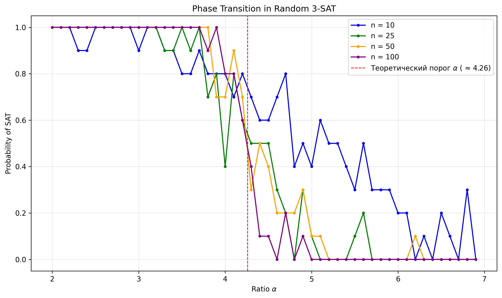

# Programming challenge - HW 1
## Task A: Formula Engine
### Task A.1: Abstract Syntax Tree
Иерархия классов наследуется от `Operand`. Каждый узел хранит `precedence` для метода `to_string`.

| Класс | Назначение |
|:---|:---|
| `Atom`, `TrueConst`, `FalseConst` | Атомарные формулы и константы |
| `Not`, `And`, `Or`, `Implies`, `Iff` | Логические связки с бинарными/унарными операндами |

### Task A.2: Pretty Printer and Parser

| Метод | Назначение | Логика работы |
|:---|:---|:---|
| `to_string` | `AST` $\to$ строка с *минимальными* скобками | Рекурсивный обход. Добавляет `()` если `curPrecedence > child.precedence`. |
| `parse` | Строка $\to$ `AST` | `pyparsing.infixNotation` сопоставляет операторы с конструкторами, учитывает приоритеты. |

### Task A.3: Evaluator and Truth Tables

| Метод | Назначение | Логика работы |
|:---|:---|:---|
| `eval` | Вычисление формулы | Рекурсивная интерпретация. Для `Atom` берёт значение из `dict`. |
| `extract_atoms` | Сбор переменных | Рекурсивный `set` union имён всех `Atom`. |
| `truth_table` | Генерация таблицы истинности | Перебор `itertools.product([F, T], repeat=N)`. |
| `is_tautology` / `is_satisfiable` / `is_contradiction` | Анализ выполнимости | Перебор с ранним выходом при нахождении первого совпадения/противоречия. |

### Task A.4: Normal Forms

| Метод | Назначение | Логика работы |
|:---|:---|:---|
| `to_nnf` | Преобразует формулу в отрицательную нормальную форму | Устранение $\to$/$\leftrightarrow$. Проталкивание `not` через законы Де Моргана. Снятие двойного отрицания. |
| `to_cnf` | КНФ | Преобразует формулу в конъюнктивную нормальную форму через Тсейтина или дистрибутивность в зависимости от параметра |

### Task A.5: Equivalence and Properties

| Метод | Назначение | Логика работы |
|:---|:---|:---|
| `equivalent` | Проверка эквивалентности | Сравнение результатов `eval` для всех $2^N$ интерпретаций. |

## Task B: Proof Checker
- Подобласти отслеживаются целочисленным `level`. Строка доступна, если между ней и текущим шагом не происходило падения уровня ниже её собственного, а также если уровень строк одинаковый, то между ними не было строки ASSUMPTION

### Task B.1: Fitch Proof Representation

- `Step`: `line`, `formula`, `rule`, `references`, `level`.
- `Proof`: список `Step`.
- `Rule`: Enum с именем для правила и необходимым количеством ссылок.

### Task B.2: Proof Checker

| Метод | Назначение | Логика работы |
|:---|:---|:---|
| `check_proof` | Валидация доказательства | Проходит по шагам. Проверяет нумерацию, кол-во ссылок, соответствие правилам. |

## Task C: Real-World Applications
### Task C.1: Configuration Validation

| Метод | Назначение | Логика работы |
|:---|:---|:---|
| `validate_config` | Проверка конфигурации | Проверяет, удовлетворяет ли конфиг всем формулам. |
| `find_valid_configs` | Поиск всех допустимых конфигов | Перебор всех комбинаций атомов. Возвращает список $dict$, где все формулы истинны. |
| `explain_conflict` | Анализ нарушений | Находит невалидные формулы для заданного конфига. Ищет валидный конфиг с *минимальным* количеством изменений изначального конфига. |

### Task C.2: SMT Solver Integration

| Метод | Назначение | Логика работы |
|:---|:---|:---|
| `z3_solve` | SAT-решение через Z3 | `solver.check()` возвращает SAT/UNSAT |
| `generate_random_cnf` | Генератор N-SAT | Создаёт `clauses_count` дизъюнктов длины `clauses_length` из случайных атомов с случайными отрицаниями. |
| `plot_satisfiability_ratio` | График зависимости процента выполнимости от значения ratio | Для фиксированных `count_atoms` варьирует `ratio`. Считает долю SAT-решений. Строит график. |

### Phase Transition Experiment

График показывает вероятность выполнимости случайных 3-CNF формул в зависимости от отношения $\alpha = \frac{\text{clauses}}{\text{variables}}$. Для $n \in \{10, 25, 50, 100\}$ выполнено по 10 испытаний на точку. Красная пунктирная линия обозначает теоретический порог $\alpha \approx 4.26$.

# Test cases
Для каждого задания предоставлены тестовые случаи, демонстрирующие корректную работу реализованных функций в `main.py` каждого задания